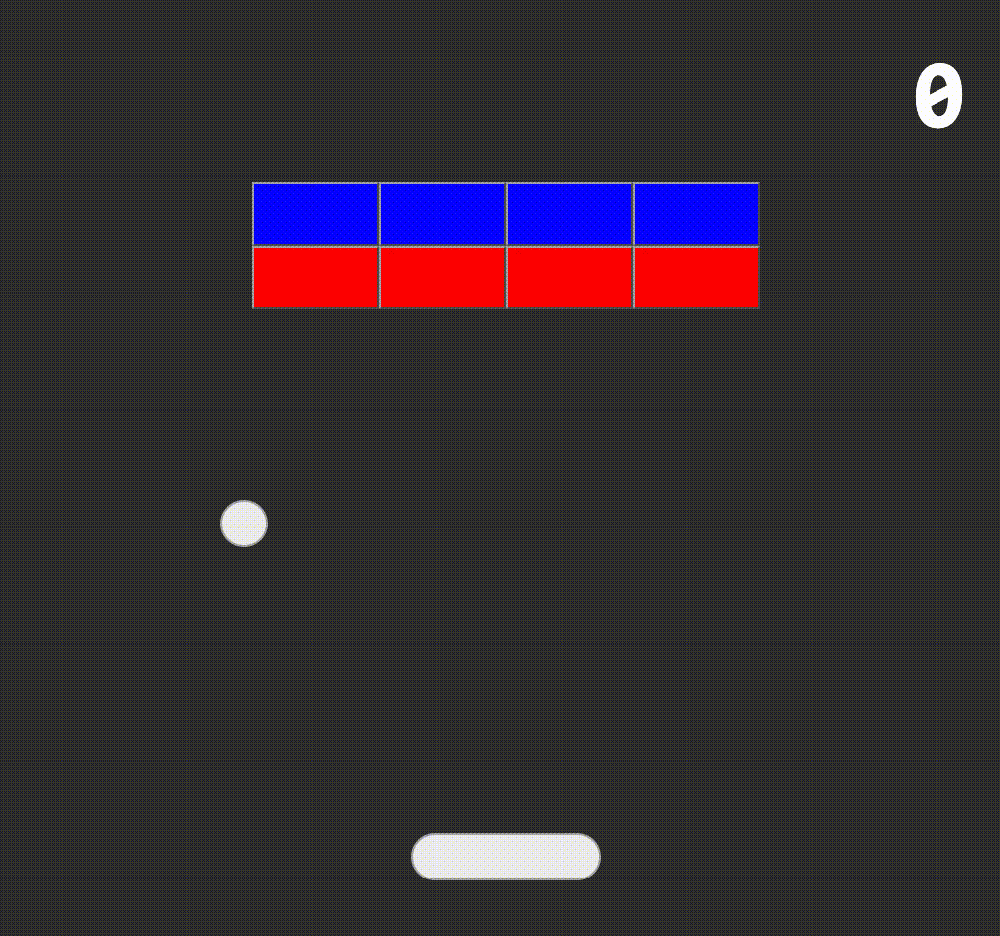

# React Entity Component System

An ECS hook for React to make games or other interactive components.

`yarn add react-entity-component-system`



## [Play Breakout Demo](https://mattblackdev.github.io/react-entity-component-system/?path=/story/breakout--breakout)

## Why

It's fun to build games with React, and people have become successful at it. The ECS pattern is well known and battle tested for game development. This library is a loose implementation for React. You can check out the [Breakout storybook story](https://github.com/mattblackdev/react-entity-component-system/tree/master/stories/breakout) to see a fairly complex example.

## Usage

```jsx
import React from 'react'
import useEntityComponentSystem from 'react-entity-component-system'
```

ECS has three basic concepts:

1. `Entities` represent every "object" in a scene
2. `Components` are data structures, composed to create entities.
3. `Systems` are functions that operate on entities during every update

In this implementation, an entity is defined as a plain object with at least a `Renderer` property (a React component). Other properties are `components` that will be passed as props to the `Renderer`:

```jsx
const counterEntity = {
  Renderer: props => <h4>{props.count}</h4>,
  count: 0,
}
```

A `system` is just a function and will receive the list of `entities` in the scene. Systems are allowed to mutate the entities' `components` (thanks to [immer](https://github.com/immerjs/immer)!):

```jsx
function frameCounterSystem({ entities }) {
  entities.forEach(entity => entity.count++)
}
```

The `useEntityComponentSystem` hook takes a list of entities and systems and returns the renderable result and an updater function:

```jsx
export default function BasicECS() {
  const [entities, updater] = useEntityComponentSystem(
    [counterEntity],
    [frameCounterSystem],
  )

  return (
    <div>
      <button onClick={() => updater()}>Next Frame</button>
      {entities}
    </div>
  )
}
```

When the `updater` is called, the `systems` are called. This triggers a re-render and any changes to the `entities` are reflected immediately. Combined with a loop like `requestAnimationFrame` or the provided `useGameLoop` hook, this can happen as much as 60 frames per second.

Additionally, you can pass an object to the `updater` so your systems can have access to other things:

```jsx
const gameLoop = useGameLoop(elapsedTime => {
  updater({
    gameLoop,
    elapsedTime,
  })
})
```

> See this example and more in the [stories folder](https://github.com/mattblackdev/react-entity-component-system/tree/master/stories/basic)

## Storybook

While `react-entity-component-system` is in development, you can check out the storybook to get a better sense of how things work.

```bash
git clone https://github.com/mattblackdev/react-entity-component-system.git
cd react-entity-component-system
yarn
yarn start
```

## API

### useEntityComponentSystem

### useGameLoop

### useGameEvents

### useKeysDown

## Contributing

I welcome any ideas and would really love some help with:

1. Adding Typescript types
2. Performance benchmarking and optimizations
3. More game engine API like:
   - Keeping track of "entity filters" for systems
   - MatterJS or other physics lib integration
